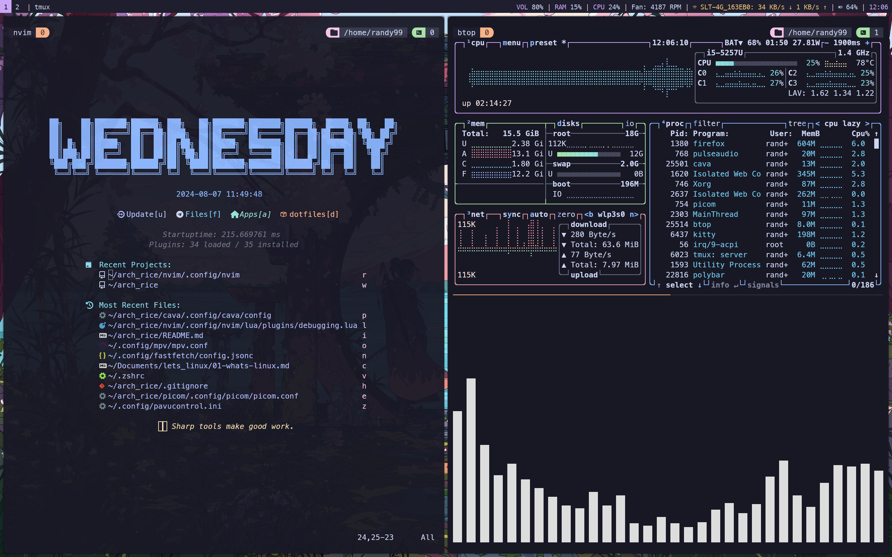

# Dotfiles-linux (i3 | TTY login | Catppuccin flavoured)

Dotfiles of my personal linux rice flavoured with catppuccin-mocha theme.

## Previews



## What's in?

1. `i3` Window Manager [WM]
2. `Kitty` i3 sensible terminal
3. `Starship` prompt
4. `ls` replaced with `eza`
5. `$LS_COLORS` managed with `vivid`
6. `zoxide` is configured (not aliased to cd though)
7. `fzf` for fuzzy finding
8. `cat` replaced with `bat`
9. `fsh` for syntax highlighting
10. `yazi` file explorer
11. `btop` system monitor
12. `neovim` (with LSP, Debugging, syntax highlighting and many more)
13. `tmux` (Configured to use vim keys)
14. `fastfetch` and for sys-info fetching
15. `.hushlogin` file to disable "last login" message.

<br>

> NOTE: Check out my individual repos for the details of my neovim and tmux configs.

➡️ neovim repo - https://github.com/Chamal1120/Lazy-neovim-config
<br>
➡️ tmux repo - https://github.com/Chamal1120/Custom_tmux_config

## How to use
I manage my dotfiles with GNU `stow`. follow the below steps to simlink the files to necessary locations.

1. Install with any package manager. (or build from source).

```bash
yay -S stow # replace with your package manager's syntax
```

2. clone the repo

```bash
git clone https://github.com/Chamal1120RE/dotfiles-linux.git
```
3. Navigate to the directory

```bash
cd dotfiles-linux/
```

4. Simlink the configs you need with `stow`.

```bash
stow bat btop fsh kitty nvim starship tmux yazi yt-dlp zsh hushlogin # This command will symlink all the configs
```

## Credits

This project uses the following open-source packages and applications. Special thanks to their authors and maintainers:

- [Git](https://github.com/git/git) - A free and open source distributed version control system.
- [Wget](https://git.savannah.gnu.org/cgit/wget.git) - A network utility to retrieve files from the web.
- [homebrew](https://github.com/Homebrew/brew) - The missing package manager for macOS (or Linux).
- [eza](https://github.com/eza-community/eza) - A modern, maintained replacement for ls.
- [fd](https://github.com/sharkdp/fd) - A simple, fast and user-friendly alternative to 'find'.
- [fzf](https://github.com/junegunn/fzf) - A general-purpose command-line fuzzy finder.
- [ripgrep](https://github.com/BurntSushi/ripgrep) - A line-oriented search tool that recursively searches the current directory for a regex pattern.
- [vivid](https://github.com/sharkdp/vivid) - A themeable LS_COLORS generator with a rich filetype datebase.
- [Neovim](https://github.com/neovim/neovim) - Hyperextensible Vim-based text editor.
- [tmux](https://github.com/tmux/tmux) - A terminal multiplexer.
- [starship](https://github.com/starship/starship) - The minimal, blazing-fast, and infinitely customizable prompt for any shell.
- [zsh-fast-syntax-highlighting](https://github.com/zdharma-continuum/fast-syntax-highlighting) - Fast syntax highlighting for Zsh.
- [yazi](https://github.com/sxyazi/yazi) - Yet another command line fuzzy finder.
- [yt-dlp](https://github.com/yt-dlp/yt-dlp) - A youtube-dl fork with additional features and fixes.
- [GNU Stow](https://git.savannah.gnu.org/cgit/stow.git) - A symlink farm manager.
- [bat](https://github.com/sharkdp/bat) - A cat(1) clone with syntax highlighting and Git integration.
- [btop](https://github.com/aristocratos/btop) - A monitor of resources.
- [zoxide](https://github.com/ajeetdsouza/zoxide) - A smarter cd command.
- [kitty](https://github.com/kovidgoyal/kitty) - A cross-platform, fast, feature-rich, GPU based terminal emulator.
- [Firefox](https://github.com/mozilla/gecko-dev) - The popular open-source web browser.
- [Rectangle](https://github.com/rxhanson/Rectangle) - Move and resize windows on macOS using keyboard shortcuts or snap areas.
- [Alt-Tab](https://github.com/lwouis/alt-tab-macos) - Windows alt-tab on macOS.

### Thanks N3RDS ❤️
